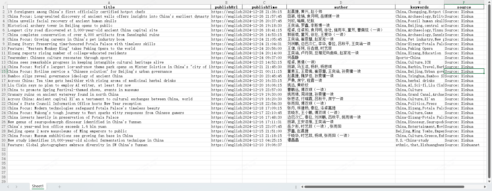

# Spider XINHUANET

## Overview
Spider XINHUANET is a Python-based application designed for collecting, analyzing, and visualizing the latest news from Xinhua News Agency. It supports data storage in MongoDB, synchronization with Elasticsearch, and allows users to query data using specific conditions.


## Features
- Automatically crawls the latest news from Xinhua News Agency.
- Visualizes and analyzes the collected news.
- Downloads collected data as an Excel file.
- Stores data in MongoDB.
- Synchronizes data with Elasticsearch.
- Allows querying data from Elasticsearch or MongoDB based on specific conditions.

## Modules
- **Spider**: Responsible for real-time crawling of the latest news from Xinhua News Agency and visualizing the data.
- **sync_es**: Handles the synchronization of data from MongoDB to Elasticsearch.
- **Collect**: Provides functionality for querying data from both MongoDB and Elasticsearch based on user-defined conditions.


## Technologies and Libraries Used
- **Python Libraries**:
  - `streamlit`: For creating the web interface.
  - `pyecharts`: For data visualization.
  - `pymongo`: For interacting with MongoDB.
  - `elasticsearch`: For integrating with Elasticsearch.

- **Technologies**:
  - MongoDB: NoSQL database for storing collected data.
  - Elasticsearch: Search and analytics engine for indexing and querying data.
  - Docker-compose: For containerizing the application and managing dependencies.

## Requirements
- Python 3.9
- Docker (for containerization)
- MongoDB (for data storage)
- Elasticsearch (for data synchronization and querying)

## Installation

**precondition**: It is necessary to ensure that the host has a complete Docker environment and more than 4GB of storage.


1. Clone the repository:
   ```bash
   git clone https://github.com/LiYichenESIEE/data_engi_lyc_projet.git
   ```


2. Use project:
  ```bash
	docker-compose up -d
	```


## Example
1、dashboard page


2、spider page




3、sync mongo to es


4 、collect


## result
### Practical Project Summary

In this project, I utilized four key technologies: Streamlit, Docker Compose, MongoDB, and Elasticsearch. Throughout the experiment, I encountered several challenging issues, including:

- How to correctly configure port mapping in Docker Compose.
- Streamlit's data download button redirecting to a blank page after being clicked.
- Connection issues with MongoDB after setting a password.
- The complexity of crafting query conditions in Elasticsearch.

### Key Learnings:
- Using Streamlit to trigger web scraping programs for data acquisition.
- Successfully storing real-time collected data into MongoDB.
- Standardizing query conditions for both MongoDB and Elasticsearch.
- Quickly setting up the project using Docker Compose.
- Analyzing data efficiently with Streamlit and Pyecharts.
- Synchronizing MongoDB data with Elasticsearch.

### TODO
- Implement direct data integration into Elasticsearch during the scraping process.
- Differentiate between production and test environments in MongoDB to ensure data persistence.
- Expand real-time data collection to cover more news websites.
- Perform data cleaning and display the cleaned data on a dedicated Streamlit webpage.
- Add a visualization dashboard to monitor total database size and daily data collection statistics.
